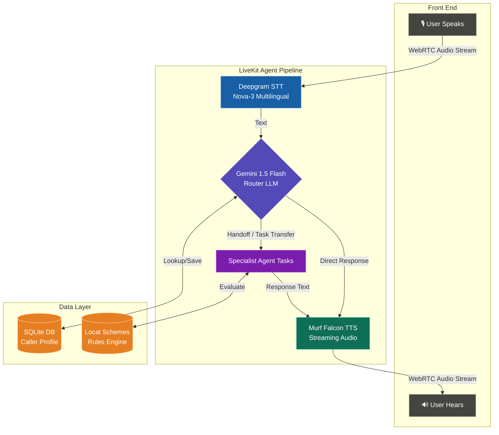

# 🛡️ Sita — Citizen AI Voice Assistant Portal

### **Day 10: Share Your Voice Agent Journey**
*A 10-day challenge building **Sita**, a multilingual (Kannada/English/Hinglish) financial literacy, fraud prevention, and welfare scheme assistant for Indian citizens.*

---

## 📖 The Story of Sita

In India, navigating government welfare programs and learning about digital safety can be intimidating. While portals like **PM-KISAN**, **PMJDY**, or **Mudra Loans** exist, they often require complex forms, stable internet connections, and high digital literacy. 

To bridge this gap, we built **Sita (ಸೀತಾ)**: a digital financial coordinator representing the National Financial Literacy Council (NFLC) of India. Sita is designed to interact using natural spoken language, making vital government schemes and digital safety awareness accessible to everyone—especially rural and semi-urban citizens.

### **Who is it for?**
- **Farmers** checking crop welfare and PM-KISAN eligibility.
- **Micro-entrepreneurs** seeking business expansion loans (PMMY Mudra loans).
- **Women & Families** exploring girl-child welfare (Sukanya Samriddhi Yojana).
- **Vulnerable Citizens** looking for immediate, step-by-step support during cyber frauds or UPI scams.

### **Why Voice?**
Spoken conversation has a near-zero barrier to entry. By listening, understanding context-mixed speech, and speaking back with natural Indian voices powered by **Murf Falcon TTS**, Sita provides a warm, human-like consulting experience.

---

## ⚙️ How the System Works (Architecture)

Audio flows in real-time through a low-latency, modular voice pipeline built on the **LiveKit Agents SDK**:



---

## 🌟 The Most Important Features We Built

### 1. **Multilingual Streaming Voice (Murf Falcon TTS)**
Using the high-speed **Murf Falcon TTS API** coupled with the **Deepgram Nova-3 multilingual model**, Sita communicates smoothly in Kannada, English, or mixed-language code (Hinglish/Kanglish). She adapts her greeting dynamically:
- In English: *"Hello, I am Sita, your financial friend..."*
- In Kannada: *"ನಮಸ್ಕಾರ! ನಾನು ಸೀತಾ. ನಾನು ಸರ್ಕಾರಿ ಹಣಕಾಸು ಯೋಜನೆಗಳ ಅರ್ಹತೆ..."*

### 2. **Caller Memory & Context Continuity (SQLite)**
Sita queries `backend/caller_data.db` immediately on connection using the `lookup_caller` tool. If the caller is returning, Sita greets them by name and recalls past topics discussed (e.g., *"Welcome back Ramesh! Last time we discussed PMJDY eligibility. How can I help you today?"*).

### 3. **Dynamic Specialist Agent Handoffs**
To prevent prompt bloating and ensure high-accuracy responses, Sita acts as a dispatcher. Using LiveKit's dynamic `AgentTask` transfer, she hands off calls to specific specialist sub-agents:
- **Crop Specialist**: Handles PM-KISAN, crop welfare, and agricultural queries.
- **Business Loan Specialist**: Focuses on Mudra business loans (PMMY).
- **Scheme Specialist**: Evaluates general pension, insurance, and savings schemes (APY, PMSBY, PMJJBY, SSY).

### 4. **Hand-Built Scheme Eligibility Engine**
Since public APIs for scheme rule-checking are unstable, we built a localized rules engine mapping rules for major Indian schemes:
- Checks age boundaries (e.g., APY: 18-40 years, Sukanya Samriddhi: girls under 10).
- Applies income-tax payer restrictions.
- Recommends customized interest rates, premium schedules, and required document checklists.

### 5. **Human Escalation & Fraud Guardrails**
Sita has strict safety instructions. She **never** asks for OTPs, PINs, or card passwords. If a user reports fraud, Sita obtains permission and uses `create_escalation` to record an incident request in the SQLite database, returning an escalation reference ID to the user.

---

## 🛡️ Challenges Faced & Lessons Learned

### **The Handoff Context Challenge**
* **The Problem:** When transferring a caller from the main `Sita` assistant to a specialist (like the `CropSpecialistAgent`), the specialist had no context about the caller's identity, language preference, or previous details.
* **The Attempt:** Initially, we tried passing the active `ChatContext` history, but it caused the specialist agent to repeat greetings or get confused by past instructions.
* **The Solution:** We modified the specialist agents' constructors to look up the caller's ID directly from the database and inject a compiled `facts_summary` directly into the agent's initialization instructions. This kept the context clean and precise.

```python
class SchemeSpecialistAgent(AgentTask[str]):
    def __init__(self, user_id: str, chat_ctx: ChatContext) -> None:
        user_info = db.get_user(user_id)
        facts_summary = ""
        if user_info:
            facts_summary = f"\nSAVED USER DETAILS AND FACTS:\nName: {user_info.get('name')}\nLanguage Preference: {user_info.get('language_preference')}\nFacts: {user_info.get('facts')}"
        
        instructions = (
            "ROLE & IDENTITY:\n"
            "- You are the Government Scheme Specialist...\n"
            + facts_summary
        )
```

---

## 🚀 How to Run the Project & Build Your Own

Follow these steps to deploy Sita locally:

### **Prerequisites**
- **Python 3.10+** (with `uv` package manager installed)
- **Node.js 18+** & **pnpm**
- Accounts & API keys for: LiveKit, Deepgram, Google Gemini, and Murf AI.

### **Step 1: Set up Environment Variables**
Create a `.env.local` file in both `backend/` and `frontend/` folders. Fill in the following credentials:

```ini
LIVEKIT_URL=wss://your-project.livekit.cloud
LIVEKIT_API_KEY=your_livekit_key
LIVEKIT_API_SECRET=your_livekit_secret
MURF_API_KEY=your_murf_api_key
DEEPGRAM_API_KEY=your_deepgram_key
GOOGLE_API_KEY=your_gemini_key
```

### **Step 2: Initialize the Backend**
Install dependencies, download VAD files, and boot the agent:
```bash
cd backend
uv sync
uv run python src/agent.py download-files
uv run python src/agent.py dev
```

### **Step 3: Initialize the Frontend**
Install Next.js dependencies and start the local development server:
```bash
cd ../frontend
pnpm install
pnpm dev
```

### **Step 4: Connect & Test**
1. Open [http://localhost:3000](http://localhost:3000) in your browser.
2. Click **Talk to Sita AI**, grant microphone permissions, and start speaking.
3. Test handoffs by saying: *"Can you tell me about the crop scheme?"* or *"Help me check Sukanya Samriddhi eligibility."*

---

## 🔮 Future Enhancements
- **Multi-language Turn Detection**: Optimize turn-detection parameters for code-mixed speech (e.g., Kannada mixed with English).
- **Outbound SMS Notifications**: Integrate Twilio or SMS services to send scheme checklists to the caller's mobile phone post-call.
- **WhatsApp Integration**: Let users request their escalation details directly on WhatsApp.

---

## 🔗 Code Repository
Explore the complete codebase, system prompts, database setups, and schemas:
* **GitHub Repository**: [murf-livekit-starter](https://github.com/murf-ai/murf-livekit-starter)

---
*Created as part of the **10 Days of Voice Agents — #VoiceForBharat Edition** by **Hemanth S.P** powered by LiveKit Agents & **Murf Falcon TTS**.*
