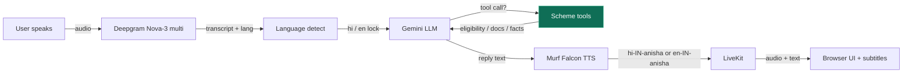

# Jan Sahay — Finance Voice Agent (Day 5)

**जन सहाय** is a bilingual voice AI companion for **financial literacy in India**. It explains government schemes (PMJDY, PMSBY, PMJJBY, APY), checks **scheme eligibility** from answers you give, returns a **document checklist**, and covers digital payments (UPI) and banking safety — with hard guardrails so it never asks for OTP/PIN/account numbers or promises scheme approval.

Built for **#10DaysOfAIVoiceAgents** / **#VoiceForBharat** on top of [Murf Falcon](https://murf.ai) + [LiveKit Agents](https://docs.livekit.io/agents).

[](https://opensource.org/licenses/MIT)
[](https://murf.ai/api/docs/text-to-speech/streaming)
[](https://docs.livekit.io)

---

## Day 5 goals — The Tools

| Goal | What we shipped |
| --- | --- |
| **Function tools** | `check_scheme_eligibility`, `get_document_checklist`, `get_scheme_info` |
| **Domain data** | Hand-built local dataset for PMJDY / PMSBY / PMJJBY / APY (see [Data source](#data-source-day-5)) |
| **Tool descriptions** | Careful WHEN / WHEN NOT / FAILURE PATH docstrings so the model fires tools at the right time |
| **Failure path out loud** | Tools return speakable error payloads; agent must apologise, never invent eligibility |
| **Data vintage** | Every tool result includes `data_as_of` + `data_source`; agent says the vintage out loud |
| **Demo** | Ask “Am I eligible for PMSBY? I’m 35 and have a bank account” → tool fires → spoken result |

Also fixed **silent-on-connect**:

| Bug | Cause | Fix |
| --- | --- | --- |
| Agent never speaks when call starts | `FIRST_GREETING` was emptied | Restored a **short** Hindi greeting via `session.say(...)` |
| Agent ignores “Hello” / “Hi” | Noise filter required 2+ words and 6+ chars | Allowlist for short greets (`hi`, `hello`, `namaste`, …) |

---

## Architecture



**Pipeline:** Deepgram STT → Gemini LLM (+ tools) → Murf Falcon TTS, over LiveKit realtime audio.

---

## Data source (Day 5)

> **Honest disclosure:** There is no free, stable public government API that returns
> live eligibility for PMJDY / PMSBY / PMJJBY / APY in a form safe for a voice agent.
> Day 5 therefore uses a **hand-built local dataset** in `backend/src/schemes.py`,
> compiled from publicly documented scheme parameters.

| Field | Value |
| --- | --- |
| **Source type** | Local hand-built dataset (not a live gov API) |
| **File** | `backend/src/schemes.py` → `SCHEMES` |
| **Schemes** | PMJDY, PMSBY, PMJJBY, APY |
| **Vintage** | `DATA_AS_OF = "2025-04 (local hand-built dataset…)"` |
| **What the agent says** | Always mentions `data_as_of` so the listener knows figures may change |

Premiums, cover amounts, and age bands can change. The agent is instructed to treat
tool output as **guidance only** and direct callers to the bank branch / CSC / official
portal for final confirmation.

---

## Day 5 tools

### 1. `check_scheme_eligibility`

Collects answers already given (age, bank account, residency, …) and returns:

- `likely_eligible` / `likely_not_eligible` / `need_more_info`
- `speak_summary` the agent can read out loud
- `data_as_of` vintage stamp
- blockers / missing fields

**Example ask:** *“Am I eligible for PMSBY? I am 35 and I have a bank account.”*

### 2. `get_document_checklist`

Returns required + optional documents for a scheme, with a spoken summary.

**Example ask:** *“What documents do I need for Jan Dhan?”* / *“APY ke liye kaun se papers lagenge?”*

### 3. `get_scheme_info`

Structured overview (summary, age band, premium, benefits) with vintage stamp.

**Example ask:** *“Tell me about Atal Pension Yojana.”*

### Failure path

If the dataset lookup fails or the scheme name is unknown, the tool returns
`ok: false` + a speakable `message`. The system prompt requires the agent to
**say that out loud** — never go silent, never invent numbers or eligibility.

---

## Repo layout

```
finance_voice_agent/
├── backend/
│   └── src/
│       ├── agent.py      # Voice pipeline, greeting, language, tools
│       ├── prompt.py     # Jan Sahay SYSTEM_PROMPT + tool rules
│       ├── schemes.py    # Local scheme dataset + eligibility logic
│       └── db.py         # Caller memory (Day 4)
├── frontend/             # Next.js LiveKit Agents UI
├── start_app.sh
└── README.md
```

---

## Quickstart

### Prerequisites

- Python **3.10+** and [**uv**](https://docs.astral.sh/uv/)
- Node.js **18+** and **pnpm**
- API keys (see below)
- Optional local [LiveKit server](https://docs.livekit.io/home/self-hosting/local/) **or** [LiveKit Cloud](https://cloud.livekit.io/)

### 1. Environment

```bash
cp backend/.env.example backend/.env.local
cp frontend/.env.example frontend/.env.local
```

| Variable | Service | Required |
| --- | --- | --- |
| `LIVEKIT_URL` | LiveKit Cloud or local `ws://127.0.0.1:7880` | Yes |
| `LIVEKIT_API_KEY` | LiveKit | Yes |
| `LIVEKIT_API_SECRET` | LiveKit | Yes |
| `MURF_API_KEY` | [murf.ai](https://murf.ai/api/dashboard) | Yes |
| `DEEPGRAM_API_KEY` | [deepgram.com](https://deepgram.com) | Yes |
| `GOOGLE_API_KEY` | [Google AI Studio](https://aistudio.google.com/) | Yes |

### 2. Install & run

```bash
cd backend && uv sync && uv run python src/agent.py download-files
cd ../frontend && pnpm install

# from repo root
./start_app.sh
# or: backend `uv run python src/agent.py dev` + frontend `pnpm dev`
```

Open **http://localhost:3000** → **Start talking** → allow mic.

### 3. Unit tests (no live APIs needed)

```bash
cd backend
uv run pytest tests/test_schemes.py tests/test_db.py -q
```

---

## Day 5 demo script

1. **Call connects** → agent greets once as Jan Sahay (short Hindi intro).
2. **English:** “Am I eligible for PMSBY? I’m 35 and I have a bank account.”
   → tool `check_scheme_eligibility` → spoken likely-eligible + **data as of …**
3. **Documents:** “What documents do I need for PMJJBY?”
   → tool `get_document_checklist` → spoken checklist + vintage.
4. **Failure / unknown:** “Am I eligible for Super Crypto Pension?”
   → tool returns unknown scheme → agent lists supported schemes out loud.
5. **Safety still holds:** OTP / PIN requests refused; no approval promises.

---

## Key files

| File | Role |
| --- | --- |
| `backend/src/schemes.py` | Local dataset, eligibility engine, document lists, `DATA_AS_OF` |
| `backend/src/agent.py` | Tools + short greeting + short-greet noise allowlist |
| `backend/src/prompt.py` | When to call tools, failure path, vintage rules |
| `backend/src/db.py` | Caller memory (Day 4) |
| `backend/tests/test_schemes.py` | Eligibility / checklist / tool registration tests |

---

## Configuration cheatsheet

| What | Where |
| --- | --- |
| Persona / guardrails / tool rules | `backend/src/prompt.py` |
| Scheme data + eligibility logic | `backend/src/schemes.py` |
| LLM model stack | `google.LLM(model=...)` fallback in `agent.py` |
| Hindi voice | `VOICE_HI = "hi-IN-anisha"` |
| English voice | `VOICE_EN = "en-IN-anisha"` |
| STT | `deepgram.STT(model="nova-3", language="multi")` |
| Branding | `frontend/app-config.ts` |

---

## Responsible AI (non‑negotiable)

- **Never** ask for OTP, PIN, UPI PIN, password, card, Aadhaar, or account number
- **Never** invent or share secrets
- **Never** promise scheme / loan / claim approval (tools say “likely” only)
- Always state **data vintage** from tools
- Escalate account-specific tracking to bank branch / official portal / helpline

---

## Troubleshooting

| Symptom | Likely cause | Fix |
| --- | --- | --- |
| Agent silent when call starts | Old build with empty greeting | Restart agent on this branch; should hear short Namaste intro |
| “Hello” ignored | Old noise filter | Restart agent — short greets are allowlisted |
| Stuck on “thinking…” | Gemini **429** free-tier quota | Fallback stack tries next model; wait or enable billing |
| Tool never fires | Vague ask / no age yet | Ask eligibility with age + bank account explicitly |
| No agent joins room | Agent not running / env mismatch | Same LiveKit creds on FE + BE; check agent logs |

---

## Prior days (summary)

| Day | Focus |
| --- | --- |
| 2 | Personality, bilingual replies, safety guardrails, subtitles |
| 3 | Avatar / louder voice / status UX |
| 4 | Caller memory across calls (`lookup_caller` / `save_caller_memory`) |
| **5** | **Scheme tools: eligibility + document checklist + dated local data** |

---

## License

MIT — see [LICENSE](LICENSE).

---

**Day 5 complete.** Tools that fetch real domain data, fail out loud, and say when the data is from.

`#10DaysOfAIVoiceAgents` `#MurfFalcon` `#VoiceForBharat` `#Day5`
