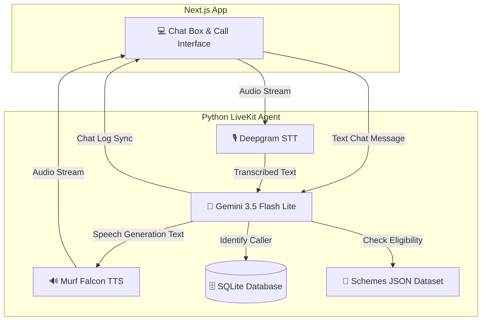

# Dhan Rakshak (धन रक्षक) — Secure AI Financial Assistant

Dhan Rakshak is an AI-powered Financial Services Voice and Text Assistant designed to make banking simple, secure, and inclusive. Built on top of the LiveKit Agents framework and powered by Murf Falcon, Gemini 3.5, and Deepgram, it guides users on banking products, digital payments, government schemes, and financial safety in English, Hindi, and Hinglish.

[](https://opensource.org/licenses/MIT) [](https://murf.ai/api/docs/text-to-speech/streaming) [](https://docs.livekit.io) [](https://www.typescriptlang.org/) [](https://www.python.org/)

---

## Key Features

- **Voice & Text Chat**: Converse with the agent using voice or type queries directly using the frontend chat interface.
- **Scheme Eligibility Check**: Verify eligibility parameters (age, gender, and setup criteria) for popular government schemes and generate official document checklists.
- **Strict Privacy Guardrails**: Programmed never to ask for or record sensitive financial data (OTP, PINs, bank accounts, CVV, or card numbers).
- **Fraud & Scam Awareness**: Educates users about digital arrest scams, phishing, and fake customer care.
- **Language Preferences**: Automatically switches between English, Hindi, and Hinglish based on user speech patterns.
- **Returning Caller Greeting**: Remembers user interactions securely using a local sqlite database and welcomes returning users by name.

---

## Supported Schemes

1. **Atal Pension Yojana (APY)**: Guaranteed minimum pension for unorganized sector workers (Age 18-40).
2. **PM Jan Dhan Yojana (PMJDY)**: Zero-balance basic savings accounts for all citizens (Age 10+).
3. **PM Jeevan Jyoti Bima Yojana (PMJJBY)**: Low-cost renewable term life insurance (Age 18-50).
4. **PM Suraksha Bima Yojana (PMSBY)**: Low-cost accident insurance coverage (Age 18-70).
5. **Sukanya Samriddhi Yojana (SSY)**: Savings scheme for girl children (Age 0-10, females only).
6. **Mudra Loan**: Collateral-free business startup and expansion loans (Age 18+).

---

## Architecture



---

## Local Dataset Usage

Because official real-time government scheme eligibility APIs are not publicly available for free/unauthenticated checkups, this project relies on a curated local dataset in [schemes_data.json](file:///d:/Agent%20bharat26/murf-livekit-starter/backend/src/schemes_data.json). 
- All scheme criteria and document checklists are loaded directly from this JSON database.
- Every response from the eligibility tool states the verification date of the rules (last updated: **August 2026**).

---

## Quickstart

### Prerequisites

- **Python** 3.10+
- **[uv](https://docs.astral.sh/uv/)** — fast Python package manager
- **Node.js** 18+
- **pnpm** — fast Node package manager
- A [LiveKit Cloud](https://cloud.livekit.io/) project (free tier available)

### Step 1: Clone and Configure

Create `.env.local` in both `backend/` and `frontend/` (copy from `.env.example` in each). Ensure you have:

| Variable | Where to get it | Required |
| --- | --- | --- |
| `LIVEKIT_URL` | LiveKit Cloud dashboard | Yes |
| `LIVEKIT_API_KEY` | LiveKit Cloud dashboard | Yes |
| `LIVEKIT_API_SECRET` | LiveKit Cloud dashboard | Yes |
| `MURF_API_KEY` | [murf.ai/api/dashboard](https://murf.ai/api/dashboard) | Yes |
| `DEEPGRAM_API_KEY` | [deepgram.com](https://deepgram.com) | Yes |
| `GOOGLE_API_KEY` | Google AI Studio (Gemini API) | Yes |

### Step 2: Install Dependencies

```bash
# Setup backend
cd backend
uv sync
uv run python src/agent.py download-files

# Setup frontend
cd ../frontend
pnpm install
```

### Step 3: Run the Application

From the repository root directory:

**Windows (PowerShell):**
```powershell
.\start_app.ps1
```

**macOS/Linux:**
```bash
chmod +x start_app.sh
./start_app.sh
```

Then navigate to **http://localhost:3000** in your browser.

---

## Running Verification Tests

To verify that the agent performs correctly and matches all security guardrails:

```bash
cd backend
uv run pytest
```

---

## Project Structure

```
murf-livekit-starter/
├── backend/                 # Python voice/text agent (LiveKit Agents + Murf Falcon)
│   ├── src/
│   │   ├── agent.py         # Agent entrypoint, pipeline (STT/LLM/TTS), tools
│   │   ├── prompt.py        # System prompt, guardrails, instructions
│   │   ├── db.py            # SQLite database helper for caller tracking
│   │   └── schemes_data.json # Schemes criteria and document lists (August 2026)
│   ├── tests/               # Unit tests
│   ├── pyproject.toml       # Python dependencies (uv)
│   └── railway.toml         # Railway deployment configuration
├── frontend/                # Next.js UI for voice and text chat sessions
│   ├── app/                 # Page components and LiveKit token endpoint
│   ├── components/          # React components (chat visualizers, input box)
│   ├── package.json         # Node dependencies (pnpm)
```

---

## License

MIT
